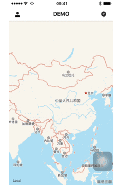

# MMSideslipDrawer

[](https://raw.githubusercontent.com/CheeryLau/MMSideslipDrawer/master/LICENSE)&nbsp;
[](https://cocoapods.org/pods/MMSideslipDrawer)&nbsp;
[](https://cocoapods.org/pods/MMSideslipDrawer)&nbsp;

侧滑菜单，支持滑动和点击，类似滴滴出行(滴滴打车)侧滑栏。



## 安装 [CocoaPods]

1. `pod "MMSideslipDrawer"`;
2. `pod install` / `pod update`;
3. `#import <MMSideslipDrawer.h>`;

## 使用说明

  MMSideslipItem属性介绍：
  
```objc
@interface MMSideslipItem : NSObject

// 头像缩略图本地路径 [若为网络路径，可直接对portraitImageView赋值，具体见MMSideslipDrawer.h]
@property (nonatomic,copy) NSString *thumbnailPath;
// 用户名称
@property (nonatomic,copy) NSString *userName;
// 用户等级
@property (nonatomic,copy) NSString *userLevel;
// 等级图片名称
@property (nonatomic,copy) NSString *levelImageName;
// 列表项名称数组 
@property (nonatomic,copy) NSArray *textArray;
// 列表项图片名称数组 
@property (nonatomic,copy) NSArray *imageNameArray;

@end
```

  创建侧滑抽屉：
  
```objc
MMSideslipItem *item = [[MMSideslipItem alloc] init];
item.thumbnailPath = [[NSBundle mainBundle] pathForResource:@"menu_head@2x" ofType:@"png"];
item.userName = @"LEA";
item.userLevel = @"普通会员";
item.levelImageName = @"menu_vip";
item.textArray = @[@"行程",@"钱包",@"客服",@"设置"];
item.imageNameArray = @[@"menu_0",@"menu_1",@"menu_2",@"menu_3"];

self.slipDrawer = [[MMSideslipDrawer alloc] initWithDelegate:self slipItem:item];
```

  侧滑：
  
```objc
[self.slipDrawer openLeftDrawerSide];
```

  关闭：
  
```objc
[self.slipDrawer colseLeftDrawerSide];
```

   代理：
   
```objc
// 查看列表项信息
- (void)slipDrawer:(MMSideslipDrawer *)slipDrawer didSelectAtIndex:(NSInteger)index;
// 查看用户信息
- (void)didViewUserInformation:(MMSideslipDrawer *)slipDrawer;
// 查看用户等级信息
- (void)didViewUserLevelInformation:(MMSideslipDrawer *)slipDrawer;
```

## 后记

如有问题，欢迎给我[留言](https://github.com/CheeryLau/MMSideslipDrawer/issues)，如果这个工具对你有些帮助，请给我一个star，谢谢。😘😘😘😘

💡 💡 💡 
欢迎访问我的[主页](https://github.com/CheeryLau)，希望以下工具也会对你有帮助。

1、自定义视频采集/图像选择及编辑/音频录制及播放等：[MediaUnitedKit](https://github.com/CheeryLau/MediaUnitedKit)

2、类似滴滴出行侧滑抽屉效果：[MMSideslipDrawer](https://github.com/CheeryLau/MMSideslipDrawer)

3、图片选择器基于AssetsLibrary框架：[MMImagePicker](https://github.com/CheeryLau/MMImagePicker)

4、图片选择器基于Photos框架：[MMPhotoPicker](https://github.com/CheeryLau/MMPhotoPicker)

5、webView支持顶部进度条和侧滑返回:[MMWebView](https://github.com/CheeryLau/MMWebView)

6、多功能滑动菜单控件：[MenuComponent](https://github.com/CheeryLau/MenuComponent)

7、仿微信朋友圈：[MomentKit](https://github.com/CheeryLau/MomentKit)

8、图片验证码：[MMCaptchaView](https://github.com/CheeryLau/MMCaptchaView)

9、源生二维码扫描与制作：[MMScanner](https://github.com/CheeryLau/MMScanner)

10、简化UIButton文字和图片对齐：[UUButton](https://github.com/CheeryLau/UUButton)

11、基础组合动画：[CAAnimationUtil](https://github.com/CheeryLau/CAAnimationUtil)

