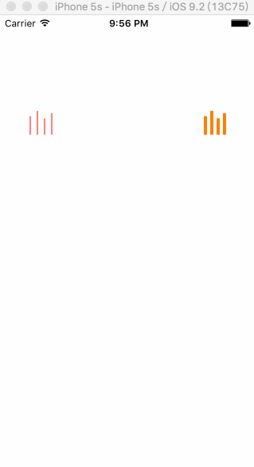

# LXSEQView
使用4个Layer实现的音乐播放柱状动画，一般用于显示音乐播放的状态。动画效果非常平滑，且随机无规律。

###图示如下：


###API说明
```objc
/*! 开始动画 */
- (void)startAnimation;

/*! 结束动画 */
- (void) stopAnimation;

/*! 柱子的宽度 */
@property (assign, nonatomic) CGFloat pillarWidth;

/*! 柱子的颜色 */
@property (strong, nonatomic) UIColor * pillarColor;

```

###使用样例
```
- (void)viewDidLoad {
    [super viewDidLoad];
    self.seqView1.pillarColor = [UIColor redColor];
    self.seqView1.pillarWidth = 2;
    
    self.seqView2.pillarColor = [UIColor orangeColor];
    self.seqView2.pillarWidth = 4;
}

- (void) viewDidAppear:(BOOL)animated {
    [super viewDidAppear:animated];
    [self.seqView1 startAnimation];
    [self.seqView2 startAnimation];
}

```