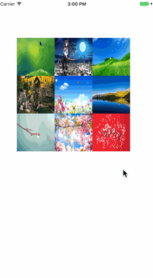

# ZJPhotoBrowser
一个简单易用的图片浏览器
由于加载大图时使用的第三方库SDWebImage,所以需要另外导入SDWebImage

 

## 使用方法
### 一、在图片的点击事件中添加以下代码,弹出浏览器
``` 
  ZJPhotoBrowser *photoBrowser = [[ZJPhotoBrowser alloc] init];
    photoBrowser.delegate = self;
    [photoBrowser showWithSelectedIndex:tap.view.tag];
```
### 二、实现代理方法

#### @required:
 1.需要显示的图片个数

```
 
-(NSUInteger)numberOfPhotosInPhotoBrowser:(ZJPhotoBrowser *)photoBrowser{
    
    return _picsArray.count;
}

```
2.返回需要显示的图片对应的Photo实例,通过Photo类指定大图的URL,以及原始的图片视图

```
- (ZJPhoto *)photoBrowser:(ZJPhotoBrowser *)photoBrowser photoAtIndex:(NSUInteger)index {
    
    ZJPhoto *zjPhoto = [[ZJPhoto alloc] init];
    zjPhoto.srcImageView = _viewArray[index];
    zjPhoto.url = [NSURL URLWithString:_picsArray[index]];
    return zjPhoto;
}
 
```
 
#### @optional

```
//返回长按的事件,默认有保存图片
- (NSArray<ZJAction *> *)longPressActionsInPhotoBrowser:(ZJPhotoBrowser *)photoBrowser image:(UIImage *)image{
    
    ZJAction* action =  [[ZJAction alloc] initWithTitle:@"自定义" action:^{
        NSLog(@"img%@", image);
        
    }];

    return @[action];
}

```
### 三、配置Plist文件

由于默认添加了保存图片的方法。
因此要在Plist文件中添加"Privacy - Photo Library Usage Description"的key来获取相册的权限。value随你填了,举个栗子："是否允许此App访问你的通讯录？"

## 最后

如果在使用中遇到任何问题或者建议，欢迎问题，我会尽快处理。
如果帮助到你，你懂的😏。


